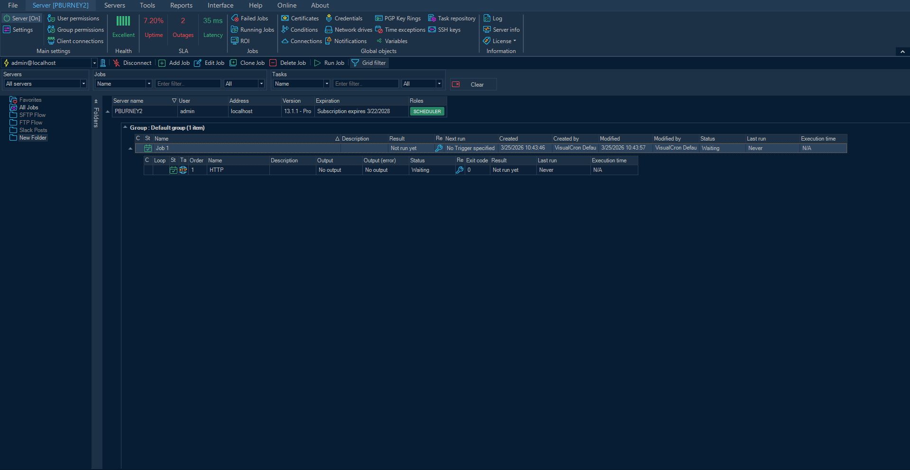
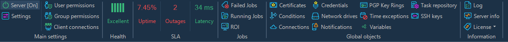
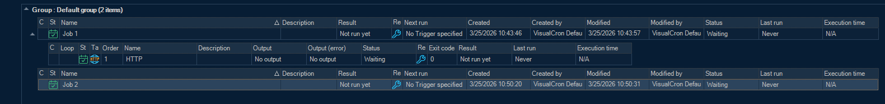
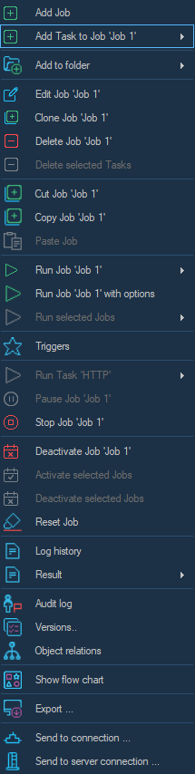

# UI Tour

This page walks you through the main areas of the VisualCron Client so you know where everything lives before you start building jobs.

---

## The Main Window

When you connect to a server, the main window shows all of your jobs and tasks in a single hierarchical grid. Everything you need to manage automation is accessible from here.

*Fig. 1 — The VisualCron Client main window, showing the ribbon menu, toolbar, job/task grid, and status bar.*

The main window is divided into four areas:

| Area | Location | Purpose |
|------|----------|---------|
| **Ribbon menu** | Top | Full access to all features, organised into tabs (Server, Interface, Help, etc.) |
| **Toolbar** | Below the ribbon | One-click actions scoped to the selected job or task |
| **Job/Task grid** | Centre | All jobs and tasks for the connected server |
| **Status bar** | Bottom | Server name, connection state, and client event indicator |

---

## The Server Menu

The **Server** ribbon tab is where you access global settings, real-time health data, and all shared objects.

*Fig. 2 — The Server ribbon tab, showing Main Settings, Health, SLA, Jobs, Global Objects, and Information sections.*

| Section | What's inside |
|---------|--------------|
| **Main settings** | Server on/off toggle, general settings, user & group permissions, client connections |
| **Health** | Live server health score, uptime, outage count, and response latency |
| **SLA** | Service level agreement metrics |
| **Jobs** | Quick access to failed jobs, running jobs, and ROI data |
| **Global objects** | Certificates, Conditions, Connections, Credentials, Network drives, Notifications, Variables, PGP Key Rings, Time exceptions, SSH Keys, Task repository |
| **Information** | Log viewer, server info, and license details |

---

## The Job/Task Grid

The grid is the heart of the client. Jobs are grouped into folders and each job can be expanded to reveal its tasks.

*Fig. 3 — The job/task grid, showing a group with two jobs — one expanded to reveal a task underneath.*

### Columns

| Column | Shows |
|--------|-------|
| **Name** | Job or task name |
| **Description** | Optional description |
| **Result** | Last execution result |
| **Next run** | Scheduled next execution time |
| **Created / Modified** | Timestamps and user |
| **Status** | Waiting, Running, Disabled, etc. |
| **Last run** | Date of last execution |
| **Execution time** | Duration of last run |
| **Output / Output (error)** | Last standard and error output (click to open) |

You can add, remove, or reorder columns from **Interface > Set Columns**.

### Status icons

| Icon | Meaning |
|------|---------|
| Green calendar | Job is active and scheduled |
| Spinning | Currently running |
| Red | Last execution failed |
| Green tick | Last execution succeeded |

### Grouping and filtering

Jobs are organised into groups (folders). Use **Interface > Group Jobs** to toggle grouping, and the **Filter** bar to search by name or status.

*Fig. 4 — The grid filter bar for narrowing the job list by name or status.*

---

## Right-Click Menu

Right-clicking any job in the grid opens the full context menu with every available action.

*Fig. 5 — The right-click context menu on a job.*

| Action | Description |
|--------|-------------|
| **Add Job / Add Task to Job** | Create a new job or add a task to the selected job |
| **Edit Job** | Open the job configuration dialog |
| **Clone Job** | Duplicate the job and all its settings |
| **Run Job / Run with options** | Trigger the job immediately |
| **Pause / Stop Job** | Pause or abort a running job |
| **Deactivate Job** | Disable the job without deleting it |
| **Triggers** | Jump directly to the job's trigger settings |
| **Log history** | View past execution logs |
| **Result** | View the last execution result |
| **Versions** | Browse and restore previous versions of the job |
| **Show flow chart** | Visualise the task execution flow |
| **Export** | Export the job configuration |
| **Send to connection / server** | Copy the job to another connection or server |

---

## Status Bar

The status bar at the bottom shows live connection information and quick-access indicators.

*Fig. 6 — The status bar showing server name, connection state, and client event indicator.*

| Element | Description |
|---------|-------------|
| **Server name** | The currently connected server |
| **Connection state** | Connected / Disconnected |
| **Client Events** | Opens the client events log — tracks what the client has done locally |
| **Folders** | Current folder context |

---

## What's Next

Now that you're familiar with the interface, build your first automated job:

- [Your First Job](your-first-job) — step-by-step guide to creating and running a job
- [Core Concepts](../core-concepts/jobs-and-tasks) — understand jobs, tasks, triggers, and flow
