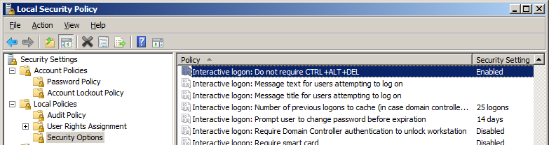
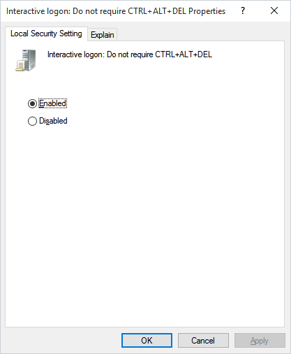
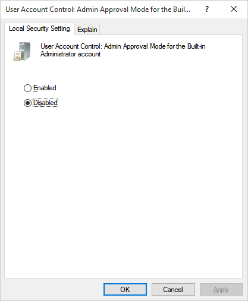

## Security

Many actions has been taken to ensure security. Look at the following chapters to learn more.

### TLS Communication Between Client and Server

We are using the [NetTcpBinding](https://learn.microsoft.com/en-us/dotnet/api/system.servicemodel.nettcpbinding?view=dotnet-plat-ext-8.0) class uses TCP for message transport. Security for the transport mode is provided by implementing Transport Layer Security (TLS) over TCP. The TLS implementation is provided by the operating system.

### Import Values are Stored Encrpyted

Important values like Username, Password etc. are encrypted by VisualCron with AES-256 encryption ensuring that no one who gets the hands of the files can read and interpret that information.

### Interactive Logon

Windows 2008 and later security settings for Credential Provider
 
Two security settings are required for "Foreground execution":
 
1. Do not require CTRL+ALT+DEL
To make interactive logon work in Windows 2008 you must disable SAS (Secure Attention Sequence). You do this by opening Administrative tools->Local Security Policy.
 
In the Local policies you need to enable "Interactive logon: Do not require CTRL+ALT+DEL" as in the image below:

This security setting determines whether pressing CTRL+ALT+DEL is required before a user can log on.
 
If this policy is enabled on a computer, a user is not required to press CTRL+ALT+DEL to log on. Not having to press CTRL+ALT+DEL leaves users susceptible to attacks that attempt to intercept the users' passwords. Requiring CTRL+ALT+DEL before users log on ensures that users are communicating by means of a trusted path when entering their passwords.
 
If this policy is disabled, any user is required to press CTRL+ALT+DEL before logging on to Windows.
 
Default on domain-computers: Enabled: At least Windows  8/Disabled: Windows 7 or earlier.
Default on stand-alone computers: Enabled.
 
 
2. User Account Control: Admin Approval Mode for the Built-in Administrator account
To be able to communicate with the Credential Provider you need to disable this setting found in Administrative tools->Local Security Policy->User Account Control: Use Admin Approval Mode for the built-in Administrator account. After applying this setting a reboot of the computer is required.
 
This policy setting controls the behavior of Admin Approval Mode for the built-in Administrator account.
 
The options are:
 
• Enabled: The built-in Administrator account uses Admin Approval Mode. By default, any operation that requires elevation of privilege will prompt the user to approve the operation.
 
• Disabled: (Default) The built-in Administrator account runs all applications with full administrative privilege.

