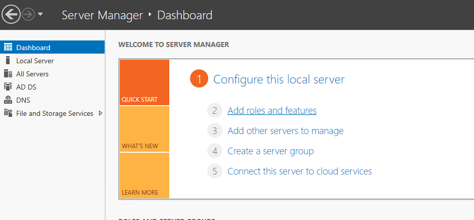
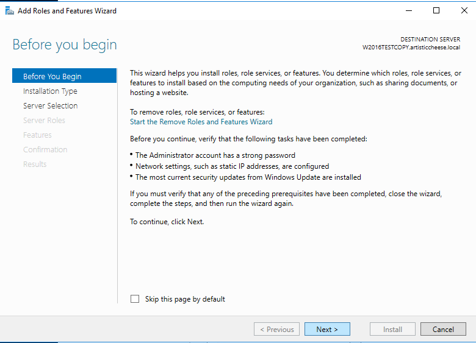
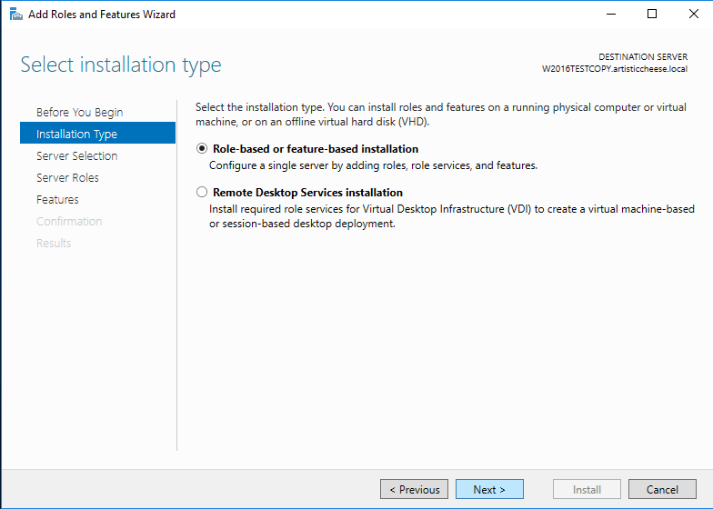
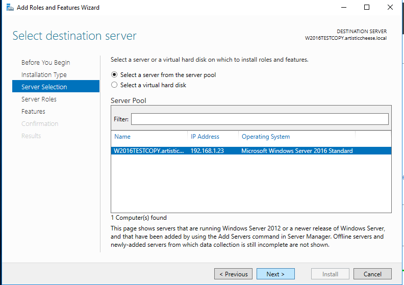
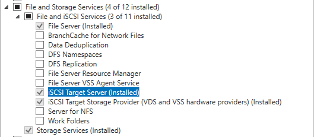
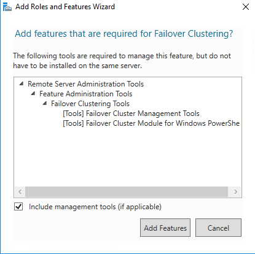

## Configure Roles / Features on Failover Cluster Access Point (FCAP)

In the **Server Manager > Dashboard**, click Add roles and features.

The Before you begin window is displayed. Click *Next*.

The select *Installation Type* window is displayed. Select *Role-based or feature-based installation*. Click *Next*.

The Select destination server window is displayed. Select the server that you are logged in on. Click *Next*.

The *Select server roles* window is displayed. In the *Roles list*, select *File Server*, *iSCI Target Server*, *iSCI Target Storage Provider*.

Click *Next*.
 
The Select features window is displayed. In the Features list, select *Failover Clustering*, *Failover Clustering Tools*. If it wasn’t installed before, the Add features that are required for Failover Clustering window will pop up. This window shows the dependencies that will be installed with this feature.

Click *Add Features*. Click Next. The Confirm installation selections window is displayed. Check the setting to ensure all selected items to be installed.

Click *Install*. The chosen Role and Feature will be installed on your machine.

When the installation is complete, restart the machine to finalize the installation.

