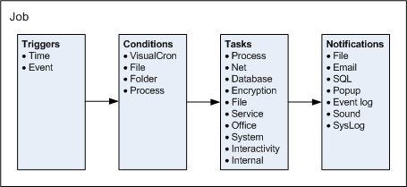

## How Does VisualCron Work?

In one aspect, VisualCron works similarly to the Unix/Linux Cron utility. Down to details of seconds, VisualCron can run any executable file periodically, within a time interval or once. However, in VisualCron also an event can be set to trig a Job.
 
It is important to understand the structure of all VisualCron objects in order to utilize the new features. The flow is: Trigger > Condition > Task > Notification. One trigger (type time or event) fires a Job to run. A condition is a "check" which is evaluated before a Job or a Task is launched. A Job can include one or more Tasks of different types. When the Job and/or its Tasks are completed, one or more notifications (of different types) may be performed.

:::info Note 

In the above figure, the lists of Conditions, Tasks and Notifications are just illustrations and not complete. The actual features in VisualCron is constantly expanding.
 
:::

One way for VisualCron to trig a Job is to keep track of time and match the current time with the time settings in the list of Jobs in order to perform the defined actions. Also, the more simple time interval can be used to trig a Job. The second way of initiating a Job is via an event trigger.
 
When you add or edit a Job, the list of Jobs and and Tasks are updated. This list defines how the Job will be managed by the VisualCron server.
 
Each Task will run as a separate process. When a Task is run, VisualCron will save some statistical values like how long time it took to run the current process.
 
It's possible to set a Job to be run only once. After this run, the Job stays in the Job list but will be ignored when the Job list is checked at later occasions.