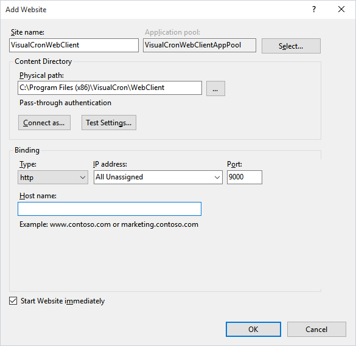

## Installation of Web Client

**Requirements**

IIS 7 or later.
 
**Installation**

The web client runs inside Microsoft IIS - a web server. It is possible to install the web client in an existing IIS or install in the free IIS Express version. Installation and configuration of ports are done in Server settings->Web client.
 
**Server > Settings > Web Client** tab

The two group boxes display installation status of either IIS or IIS Express. You can see:

* Which version of IIS is installed
* If the Web client is installed
* The local link to the web client
* The local path where the web Client is installed
* Which port is used
 
**Install**

Click on Install to install the web Client. We recommend that you use the normal IIS if it is already installed. If you click Install on IIS Express then IIS Express will be installed first (if not installed already).
 
If you need to change port you can do that in IIS or by uninstalling and installing again with a new port.
 
**Windows authentication**

If you are using Active Directory as authentication method in VisualCron > Permissions then you probably want to enable Windows Authentication in the Web Client. Click the *Enable* button to enable.
 
### Troubleshooting Web Client and installation

**Preparations**

Make sure that you have installed the selected roles and features in the Windows server.
 
**Windows 2016 Server > Server Manager > Dashboard > Add roles and features**

**Installation errors when clicking install from the Client**

Make sure that you have started the application as Administrator by right clicking on VisualCronClient.exe and select "Run as Administrator". Alternatively, turn off UAC and reboot.
 
**HTTP Error 403.14 error - Forbidden**

Please install ASP.NET 3.5 and 4.5 and other features in list mentioned above. Reboot if needed.
 
**Web interface does not display correctly or not working**

We recommend using Chrome or Firefox. If using IE make sure that Emulation mode is set to 10. See image below.

**AD logon is not working**

Open the website in IIS manager and make sure that Windows Authentication is enabled and all other authentication mechanisms are disabled.
When creating a new Server connection in server connection manager; 

1. check Use AD 
2. leave username and password empty
 
**Installing the Web Client on other location than Server**

Easiest way is to install the VisualCron Server on the IIS Server. Start the Client and connect locally and go to Server settings->Web client and install the web client as usual. Then stop and disable the VC service. For a custom installation package please contact support.
 
**Web Client settings and logon**

You logon into the web Client the same way you logon to the Windows Client. But, if you want to store settings you can click on the Login link to the upper right. It is possible to link settings and logon information to different open authentication systems like:

The advantage is that you can store settings like:

* Server connections
* Column settings
 
Facebook setup

1. create an App in Facebook
2. set *facebookAppID* and *facebookAppSecret* in web.config
 
Windows Live Id setup

1. You need to create your own app on [https://account.live.com/developers/applications/index](https://account.live.com/developers/applications/index)
 
2. * In API parameters add an URL for redirection, which finished with:
~/Home/WindowsLiveIdLogIn
( any domain can be used, like
"[http://example.localhost.com:54257/Home/WindowsLiveIdLogIn](http://example.localhost.com:54257/Home/WindowsLiveIdLogIn)" )
   on the "Application settings" tab need to find an application Id and secret key.
 
3. In order to use redirection to local IP adrress (127.0.0.1) two approaches can be used:
a. Create a DNS record like "localhost.yourcompany.com" which points to 127.0.0.1
b. Or add a record to local "host" file ( `%windir%/system32/drivers/etc/host`, need to have administrative rights to edit that):
 127.0.0.1 example.localhost.com
 
4. Setup IIS
4.1 * For IIS EXPRESS in `C:\Users%username%\Documents\IISExpress\config\applicationhost.config`
Change

`<binding protocol="http" bindingInformation="*:54257:localhost" />`

to

`<binding protocol="http" bindingInformation="*:54257:example.localhost.com" />`

4.2 * For IIS
Open Internet Information Services (IIS) Manager:
In the Connections pane, expand the server name, expand Sites, and then click the Web site on which you want to configure the bindings.
In the Actions pane, click Bindings.
In the Site Bindings dialog box, click Add.
In the Add Site Binding dialog box, add the binding information(example.localhost.com), and then click OK.
 
5. in web.config update these entries with app Id and secret from liveId application :

`<add key="wll_appid" value="appid" />`

`<add key="wll_secret" value="secret" />`
 
**Manual Web Client installation**

It is possible to manually install the web client. The current requirements are:

* the Web Client needs to be installed on the same machine as VisualCron
* IIS 7 or later is required on that machine
* a specific folder needs to be referenced from IIS
 
Steps for installing the Web Client are:
1. install the VisualCron Server on the machine
2. open IIS and add an application pool called "VisualCronWebClientAppPool". Setings are .NET 4.0 and Integrated mode

3. Right click on **Sites > Add Website**.

4. Select the VisualCronWebClientAppPool as Application pool.
5. Set the site name to "VisualCronWebClient".
6. Set the physical path to the "WebClient" folder in the VisualCron installation folder (normally in program files (x86)/VisualCron/WebClient).
7. Set any port (default 9000).
8. Click OK to save the web site
9. If you want to us AD for authentication you need to disable Anonymous Authentication and enable Windows Authentication

10. Enter url localhost:9000 in your browser to access the Web Client