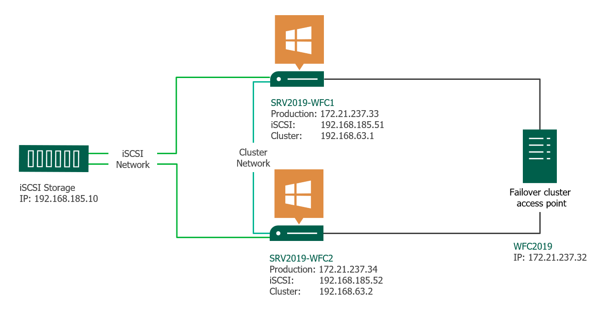

## Overview

Below is a guide for installing the feature Failover Cluster on Windows 2016.
 
 
**Installing the Failover Cluster Feature in Windows Server 2016**

**Requirements**

To use Failover Cluster Feature we need:
 
1. Server that will be a “Failover cluster access point” (FCAP) with Active Directory
2. At least 2 servers that will be an “Cluster nodes”
 
**Steps**

1. [Configure roles / features on Failover Cluster access point - FCAP](configure-roles-fcap)
2. [Configure roles / features on Nodes](configure-roles-nodes)
3. [Create a iSCI network drive](create-iscsi-network-drive)
4. [Connecting to iSCSI network drives](connecting-to-iscsi-network-drives)
5. [Create the failover cluster](create-the-failover-cluster)

