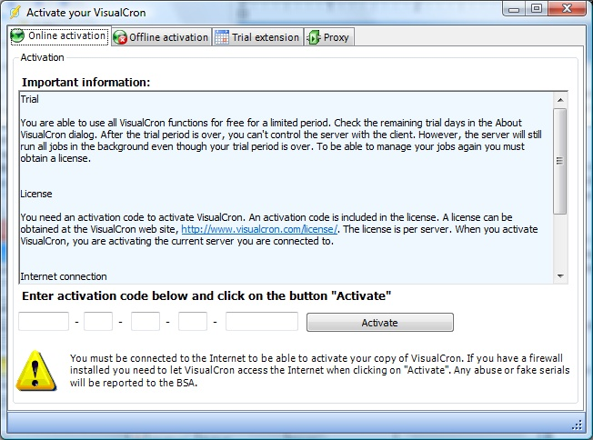
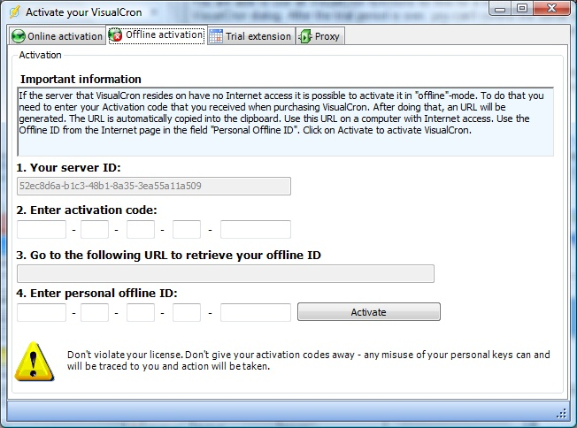

## License and Activation

**License**

You need an activation code to activate VisualCron. An activation code is included in the license. A license can be obtained at the VisualCron web site. The license is per server. When you activate VisualCron, you activate the current server you are connected to. You can use several clients to connect to one server with one license.
 
**Activation**

Once you have an activation code you can activate VisualCron. To activate VisualCron you must login to the server that you want to activate. If you have trial time left you can go to main menu *Client->Server tab->License->Activate*, which opens the activation form. If you don't have any trial time left, the activation form will open automatically when logging in. Enter the activation code in the fields.
 
**Online activation**

To be able to validate your activation code you have to connect to the VisualCron web site, this is done automatically when you click on the *Activate* button. However, you need to:

1. Be connected to the Internet
2. Let VisualCron access Internet. If your firewall asks you what to do, you must permit VisualCron to access Internet

**Offline activation**

This feature is available if you have a server without Internet access. Note that you still can use online activation if your desktop computer has access to Internet and if your desktop computer can be internally connected (within your network) to the server. If that is not possible you can use offlien activation. Offline activation can be done with the following steps:

1. Start the Client locally on your server
2. Choose Activate in the About menu
3. Choose Offline activation tab
4. Enter your activation code
5. After entering you will get an URL. Copy that url in some way to USB stick or paper. Enter the URL in a browser on a computer that has Internet access. You will then get an offline ID.
6. Enter the Offline ID in the Client

**Deactivation / Move a licenses**

Go to Server tab->License->Deactivate to Move a license. Please note that Deactivation / Move a license requires that you have an active Maintenance.