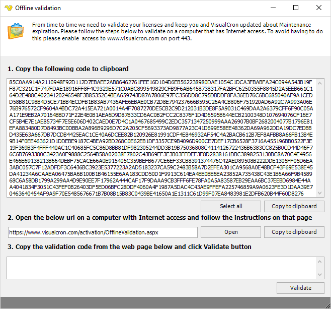

## License Validation

From time to time we need to validate your licenses and keep you and VisualCron updated about Maintenance expiration. Please follow the steps below to validate on a computer that has Internet access. To avoid having to do this, please enable access to [www.visualcron.com](https://www.visualcron.com) on port 443.
 
The below screen is shown when the computer where the VisualCron Client runs has been offline for a while. The screen is also shown when the **Server > Information > License > Refresh license data** is issued when the VisualCron Client is offline.

