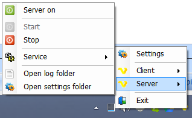

## VisualCron Tray Client

The VisualCron Tray Client is an application that is part of the VisualCron system. It is shown with a VisualCron icon in the notification area normally located in the bottom right of the Windows screen.
 
The Tray Client is located to the right in the below image. Right click to interact.

**Tray Client Startup**

The VisualCron Tray Client starts when a user logs in to the Windows server. When the Tray Client starts, it attempts to connect to the VisualCron Server in order to provide control, allow foreground execution and be able to notify the currently logged in user. When the Tray Client is connected it shows the normal VisualCron icon in the System Tray.
 
If the Tray Client icon includes a red cross, it is not connected to a server service. One of the reasons may be a stopped service. The change of the icon between having and not having a cross, is based on repeated "ping" from the client and thus it is somewhat delayed related to the actual state of the connection.
 
**Tray Client Features**

When the VisualCron Tray Client is connected to the VisualCron Server your are able to control the Client and the Server.
 
By double clicking on the Tray Client icon you start the VisualCron Client. The Client can also be started by right-click on the Tray Client icon and select *Client > Start*.
 
By right-click on the Tray Client icon you can choose *Server > Stop/Start*. You can also Stop and Start the Server service.
 
**Foreground execution**

One of the main purposes of the VisualCron Tray Client is to provide [foreground execution](../client-user-interface/server/task-main-settings-execution-context).
 
**VisualCron Tray Client > Right-click > Settings > Main** tab

*Start Tray Client on startup*

Controls if the tray client should be loaded when each user logs on to the server machine.
 
**VisualCron Tray Client > Right-click > Settings > Notifications** tab