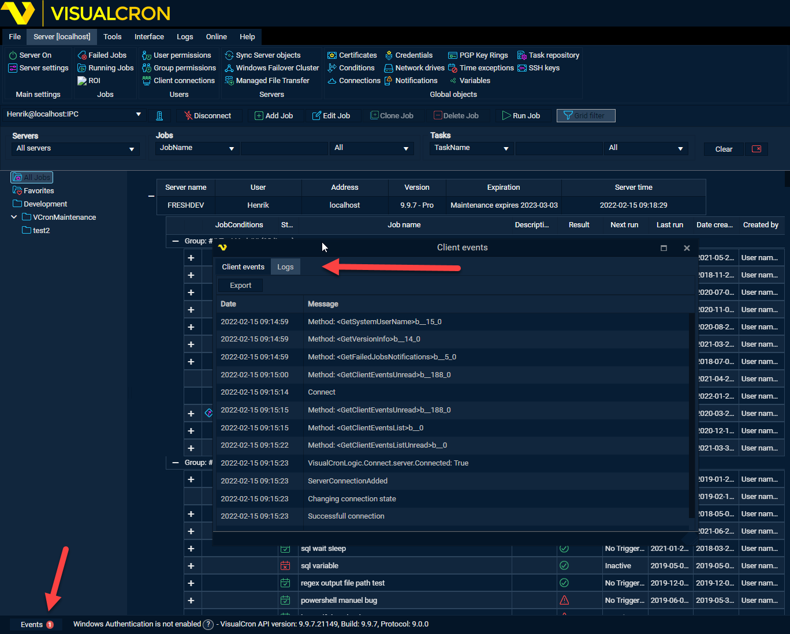

## VisualCron Web Client

The VisualCron Web Client was introduced in version 7.6.5. It lets you connect from any device (phone/browser) to the VisualCron Server. The web client has a real time interface for viewing Job and Task information. It is still very limited compared to the normal Client but good for getting an overview and do basic things like running, activating and stopping Jobs and Tasks.

**Trouble connecting?**

If the Web client gets stuck connecting you can open the Client->Events->Logs and send a screenshot to Support

[Installation and Troubleshooting](installation-of-web-client)